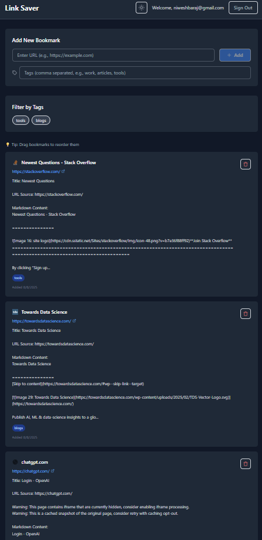
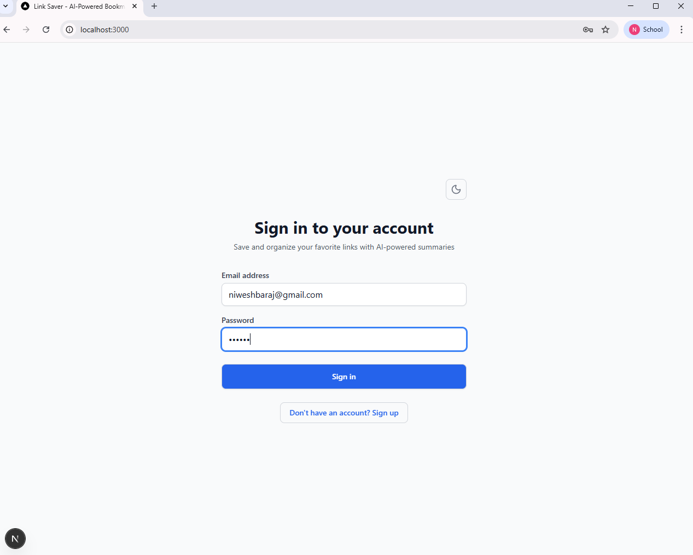
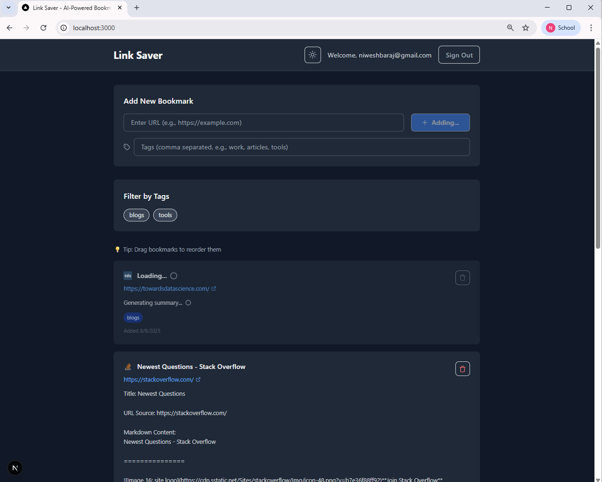
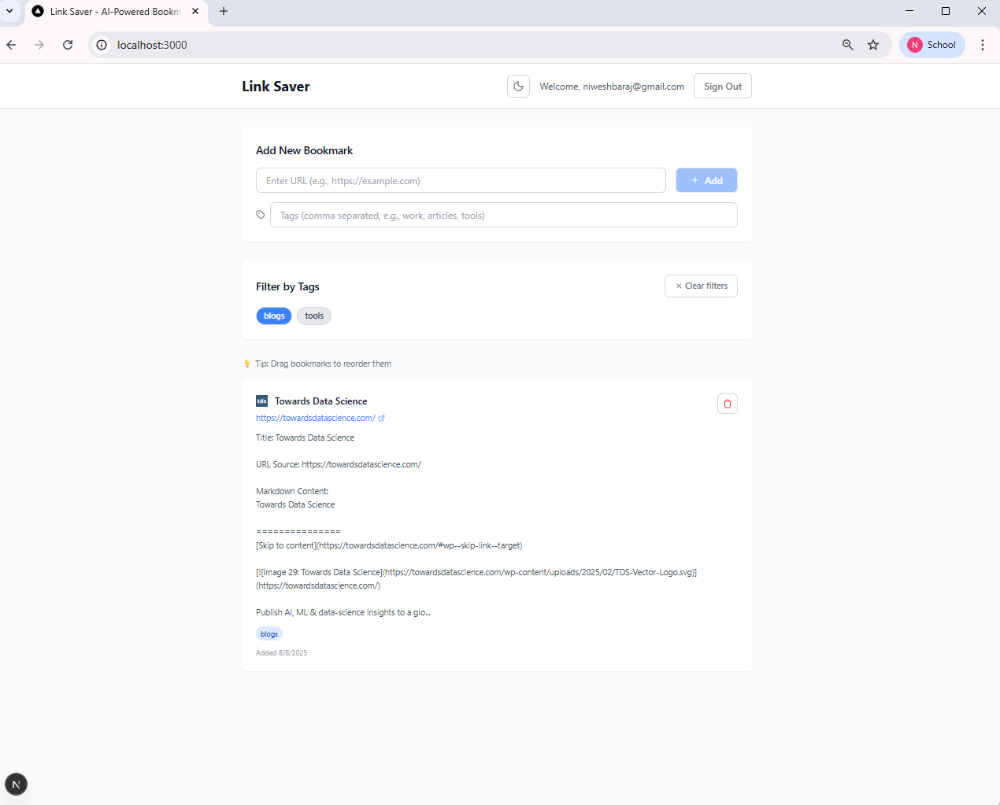

# 🔖 Link Saver - AI-Powered Bookmark Manager

A modern bookmark management application with AI-generated summaries, built with Next.js and Supabase.

## 🔗 Links

- **🚀 Live Demo**: [your-app-name.vercel.app](https://your-app-name.vercel.app)
- **📂 GitHub Repository**: [github.com/niweshbaraj/Link-Saver-Auto-Summary](https://github.com/niweshbaraj/Link-Saver-Auto-Summary)



## ✨ Features

- 🔐 **User Authentication** - Secure signup/login with Supabase
- 🤖 **AI Summaries** - Automatic content summaries using Jina AI
- 🏷️ **Smart Tags** - Organize bookmarks with tags and filtering
- 🎨 **Dark Mode** - Toggle between light/dark themes
- 📱 **Responsive Design** - Works on all device sizes
- 🔄 **Drag & Drop** - Reorder bookmarks easily
- ⚡ **Real-time** - Instant updates and optimistic UI

## 🚀 Quick Start

### 1. Clone & Install
```bash
git clone <your-repo-url>
cd link-saver-auto-summary
npm install
```

### 2. Setup Supabase Database

**Create a new Supabase project at [supabase.com](https://supabase.com)**

**Run this SQL in Supabase SQL Editor:**
```sql
-- Create bookmarks table
CREATE TABLE public.bookmarks (
  id uuid DEFAULT gen_random_uuid() PRIMARY KEY,
  user_id uuid REFERENCES auth.users NOT NULL,
  url text NOT NULL,
  title text NOT NULL,
  summary text,
  favicon text,
  tags text[] DEFAULT '{}',
  created_at timestamp with time zone DEFAULT timezone('utc'::text, now()) NOT NULL
);

-- Enable Row Level Security
ALTER TABLE public.bookmarks ENABLE ROW LEVEL SECURITY;

-- Create security policies
CREATE POLICY "Users can view own bookmarks" ON public.bookmarks
  FOR SELECT USING (auth.uid() = user_id);

CREATE POLICY "Users can insert own bookmarks" ON public.bookmarks
  FOR INSERT WITH CHECK (auth.uid() = user_id);

CREATE POLICY "Users can delete own bookmarks" ON public.bookmarks
  FOR DELETE USING (auth.uid() = user_id);

-- Create index for better tag performance
CREATE INDEX idx_bookmarks_tags ON public.bookmarks USING GIN (tags);
```

### 3. Environment Setup

**Copy `.env.example` to `.env.local`:**
```bash
cp .env.example .env.local
```

**Add your Supabase credentials to `.env.local`:**
```env
NEXT_PUBLIC_SUPABASE_URL=your_supabase_project_url
NEXT_PUBLIC_SUPABASE_ANON_KEY=your_supabase_anon_key
```

### 4. Run the Application
```bash
npm run dev
```

Visit [http://localhost:3000](http://localhost:3000) to start using the app!

## 📱 Screenshots

### Authentication

*Clean authentication interface with dark mode toggle*

### Adding Bookmarks

*Add URLs with automatic title extraction and tags*

### Tag Filtering

*Filter bookmarks by tags for easy organization*

## 🛠️ Tech Stack

| Category | Technology |
|----------|------------|
| **Frontend** | Next.js 15, React 19, Tailwind CSS |
| **Database** | Supabase (PostgreSQL) |
| **Auth** | Supabase Auth |
| **AI** | Jina AI API |
| **Icons** | Lucide React |

## 🚀 Deployment

### Step 1: Push to GitHub
```bash
git add .
git commit -m "Initial commit"
git push origin main
```

### Step 2: Deploy to Vercel
1. Go to [vercel.com](https://vercel.com) and sign up/login with GitHub
2. Click "New Project" and import your GitHub repository
3. In **Environment Variables** section, add:
   - `NEXT_PUBLIC_SUPABASE_URL`: `your_supabase_project_url`
   - `NEXT_PUBLIC_SUPABASE_ANON_KEY`: `your_supabase_anon_key`
4. Click **"Deploy"**
5. In Supabase: Authentication → Settings → Add your Vercel domain to allowed origins

## 📂 Project Structure

```
link-saver-auto-summary/
├── components/          # React components
│   ├── AuthForm.js     # Login/signup form
│   └── Dashboard.js    # Main app interface
├── contexts/           # React contexts
│   ├── AuthContext.js  # Authentication state
│   └── ThemeContext.js # Dark mode state
├── lib/               # Utility functions
│   ├── supabase.js    # Database client
│   └── utils.js       # AI summary & helpers
├── pages/             # Next.js pages
├── screenshots/       # App screenshots
└── styles/            # CSS styles
```

## 🔧 Key Features

### AI Summaries
Uses Jina AI to generate concise summaries with fallback handling for failed requests.

### Tag System
Add comma-separated tags when saving bookmarks. Click tags to filter instantly.

### Performance
Optimistic UI updates, loading states, and parallel API calls for better speed.

## 🐛 Troubleshooting

**Database Issues:** Verify Supabase URL and key in `.env.local`

**CORS Errors:** Add your domain to Supabase allowed origins

**Build Errors:** Ensure all environment variables are set (Node.js 18+ required)

---

**Built with ❤️ using Next.js and Supabase**
